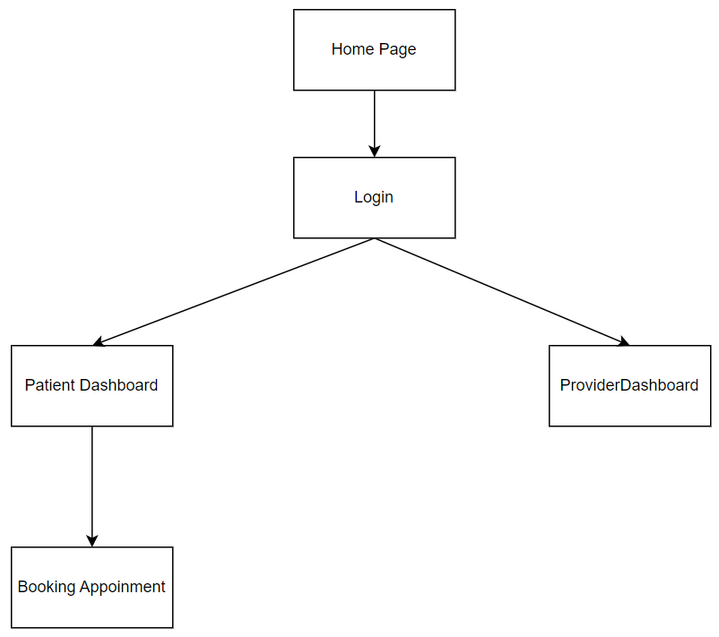

# User Flow



# API Docs

Base URL : https://hp-portal.vercel.app


## Std error response
```javascript
{
    "errorCode": "<errorCode>",
    "errorMessage": "User friendly error message",
    "data"?: {}  // specific to the api
}
```


## Login
- Endpoint -> `/api/auth/login`
- Method -> `POST`
- Request
```json
{
    "email": "user@gmail.com",
    "password": "mypass"
}
```
- Response
```json
{
    "token": "<JWT Token>",
    "userId": "11313142424",
    "firstName": "Kumaresan",
    "lastName": "K",
    "role": "doctor"
}
```

## Signup
- Endpoint -> `/api/auth/register`
- Method -> `POST`
- Request
```json
{
    "fisrtName": "Hello",
    "lastName": "User",
    "email": "user@gmail.com",
    "password": "mypass"
}
```
- Response
```json
{
    "message": "User created"
}
```

## Profile
- Endpoint -> `/api/user/profile`
- Method -> `GET`
- Request 
- Header ->  `Authorization: Bearer <token>`
- Response 
```json
{
    "userId": "11313142424",
    "firstName": "Kumaresan",
    "lastName": "K",
    "role": "doctor"
}

```

## Get doctors
- Endpoints -> `/api/doctors`
- Method -> `GET`
- Header ->  `Authorization: Bearer <token>`
- Response
```json
{
    "doctors": [
        {"id": "123", "name": "Kumaresan"}
    ]
}
```

## Get doctor slots
- Endpoint -> `/slots/:doctorId`
- Method -> `GET`
- Header ->  `Authorization: Bearer <token>`
- Request 
```json
{
    "date": "Date"
}
```
- Response 
```json
{
    "slots": ["9 AM", "10 AM"]
}
```

## Create appointement
- Endpoint -> `/appointmets/create`
- Method -> `POST`
- Header ->  `Authorization: Bearer <token>`
- Request 
```json
{
    "patientId": "1",
    "doctorId": "1",
    "date": "07/11/2024",
    "slot": "9 AM",
    "reason": "headache",
    "notes": "do not think to much"
}
```
- Response 
```json
{
    "id": "1",
    "patientId": "2",
    "doctorId": "1",
    "date": "07/11/2024",
    "slot": "9 AM",
    "reason": "headache",
    "notes": "do not think too much"
}
```

## Patients Appointments
- Endpoint -> `patients/:patientId/appointmets`
- Method -> `GET`
- Header ->  `Authorization: Bearer <token>`
- Param: url -> `patientId`
- Response
```json
[{
    "id": "1",
    "patientId": "2",
    "doctorId": "1",
    "date": "07/11/2024",
    "slot": "9 AM",
    "reason": "headache",
    "notes": "do not think too much"
}]
```

## Doctors Appointments
- Endpoint -> `doctors/:doctorId/appointmets`
- Header ->  `Authorization: Bearer <token>`
- Param: url -> `doctorId`
- Response
```json
[{
    "id": "1",
    "patientId": "2",
    "doctorId": "1",
    "date": "07/11/2024",
    "slot": "9 AM",
    "reason": "headache",
    "notes": "do not think too much"
}]
```

